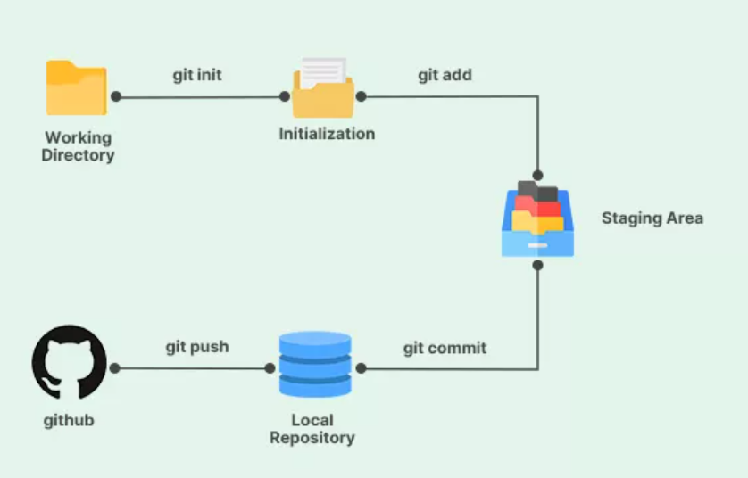
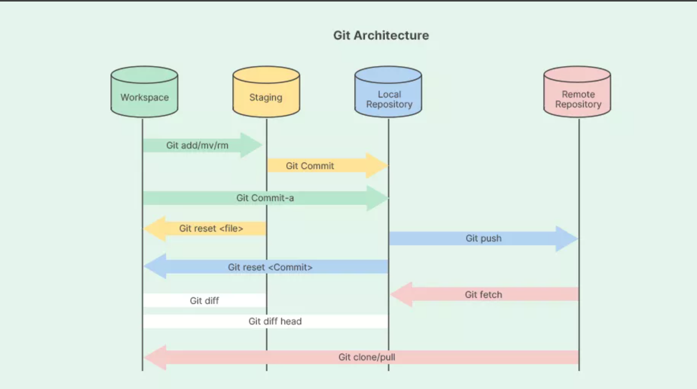

# Git and GitHub

Git is a version control system

## Version Control System (VCS)

VCS is a tool that helps track changes in code over time, collaborate with team members, and manage code history.

- Enables rollbacks to previous versions.
- Tracks who made changes, what changes has been made and when.
- Facilitates parallel development via branching.

## Repository, Commit, Branch

- Repository(Repo): Project tracked by git.
- Commit: A snapshot of code at a specific moment.
- Branch: A parallel line of development.

## Git Lifecycle

## Git Architecture

- Working Directory
  - The actual files and folders on your machine.
  - You create, edit, and delete files here.
  - Git watches changes but doesn’t track them automatically
- Staging Area
  - A temporary holding area for changes you want to commit.
  - You add files here using `git add`
  - You can choose to add the changes.
- Local Repository(`.git`).
  - Stored inside the `.git` folder.
  - Contains all commits, branches, and complete version history.
  - You save changes here using `git commit`.
- Remote Repository.
  - A Git repository hosted on a server (GitHub, GitLab, Bitbucket).
  - Used for collaboration and backup.
  - You upload changes using `git push` and download using `git pull` or `git fetch`.

# Creating, Cloning, and Connecting a Repository, First Commit and Push

## Creating a Repository

- Sign in to GitHub
- Click the "+" icon in top-right, select "New repository" or go to https://github.com/new
- Fill in the repository name(`my-git-project`), description, and choose public/private.
- You can initialize your repository with a README, .gitignore, or license file. (Initialization can also be done locally. Use initialization if you want to clone it otherwise use local initialization)
- Click "Create repository"
- You will have a remote URL like `https://github.com/yourusername/my-git-project.git`

## Initializing and Pushing to GitHub

- Create a new directory `mkdir my-git-project` and navigate into it `cd my-git-project`
- Initialize git using `git init`. It creates a new repo and creates `.git` hidden folder to track your repo.
- Create a README.md file with `echo "# my-git-project" > README.md`
- Stage the README.md file using `git add README.md`
- Commit the staged changes with `git commit -m "first commit"` to save your changes to the local repository.
- Link your local repository to GitHub using `git remote add origin https://github.com/ksubramanyeshwara/my-git-project.git`.
- Upload your commits to GitHub with `git push -u origin main`.
- The `-u` flag sets the upstream branch `main` so future pushes can be done with just `git push` which will go to `main` branch.

## Cloning a Repository

You can clone a repo only when you have existing repo in github

- Go to the GitHub repository page and click the green "Code" button. Copy the HTTPS, SSH, or GitHub CLI URL.
- Navigate to the directory where you want to clone the repository using the `cd` command.
- Type `git clone` followed by the URL you copied. For example: `git clone https://github.com/username/repository-name.git`
- Git will download all the files and commit history from the repository to your local machine.
- You can run `git status` or `ls` to confirm the files are present and the repository is properly initialized.

## git init

When you run git init, Git does the following:

- Creates a hidden .git/ folder in the current directory that stores all Git data and history.
- Initializes an empty Git repository (no commits yet)
- Sets up internal structures
  - objects/ → stores commits, trees, blobs
  - refs/ → tracks branches and tags
  - HEAD → points to the current branch
- Creates a default branch reference (usually main, but no commit yet)
- Does NOT track files automatically
  - Files stay untracked until `git add`
- Does NOT create a remote repo
  - You must add one manually with `git remote add`

> 👉 In short: `git init` turns a normal folder into a Git repository by creating the hidden .git database.

## .git folder

- Stores the complete history. Every commit, file version, branch, merge, and tag is saved here.

**⚠️ Golden rule**

- Never edit or delete .git files manually
- Always use Git commands

**👉 In one line:**

- .git is the hidden engine that tracks, stores, and manages your entire Git history.

## git commit

- `git add` Files are added and hashed and stored as blobs in `.git/objects/`. References are added to `.git/index` (the staging area).
- `git commit` Git creates a tree object that represents your project's folder structure, pointing to the staged blobs.
- A commit object is created containing the tree hash, parent commit hash(es), author info, timestamp, and commit message.
- The commit object is hashed (SHA-1) to create a unique commit ID and stored in `.git/objects/`.
- The current branch pointer in `.git/refs/heads/` (e.g., main) is updated to point to the new commit hash.
- `.git/HEAD` continues pointing to the current branch, which now points to your new commit.

## git push

It upload local repository content and commits to remote repository.

- Checks local commits that don't exist in remote repo.
- Connects to remote through the URL stored in your config.
- Verifies permissions.
- Git checks if remote repo is at where you left, if yes then push will be successfull, if not then it will be failed.
- Transfers required objects (commits, trees, blobs) to the remote.
- Updates the remote branch reference to point to the latest commit.
- Your local repository updates its record of where the remote branch is (stored in .git/refs/remotes/origin/).

1. `git push -u origin main`: Pushes `main` to `origin` AND sets it as the upstream branch. The `-u` (or `--set-upstream`) lets you use just `git push` in the future.
2. `git push`: Pushes the current branch to its configured upstream remote. Only works if upstream is already set.
3. `git push <remote> <local-branch>:<remote-branch>`
   - `git push origin main` → Push my local `main` branch to remote `main` branch
   - `git push origin main:test` → Push my local `main` branch to remote `test` branch
4. `git push origin <branch>`: Pushes a specific local branch to remote.
5. `git push --force (or -f)`: Forces the push even if it would overwrite remote history. Dangerous, use only when you're sure, as it can erase others' work.
6. `git push --all`: Pushes all local branches to the remote.
7. `git push --tags`: Pushes all local tags to the remote.
