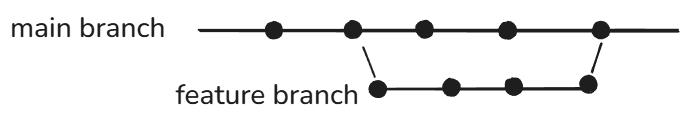
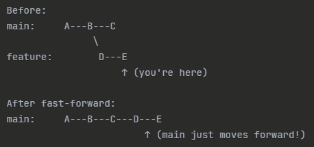
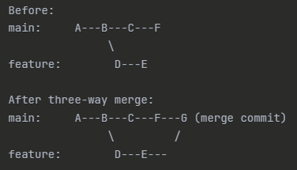

# Branch

Branch is a seperate timeline/path from the main timeline/path. Branch is independent and whatever you do in the perticular branch will not affect the other branch.

## Why do we need Branching?

### Without branching

- Everyone edits the same code
- High risk of breaking production
- Hard to experiment
- Messy history

### With branching

- Parallel development: Many team members work on different feature at the same time.
- Isolated development: Others work won't affect yours.
- Easy bug fixing: If bug appears on the app where you have worked on it will be easy to just work on your own branch without affecting other part.

## Checking all the Branches

`git branch`

## Creating a Branch

`git branch branch-name`

## Switch between Branch

- `git checkout branch-name`
- `git switch branch-name`

### Create and Switch to a new branch

- `git checkout -b feature-name`
- `git switch -c feature-name`

> Commit before switching

## Git Merge

- Git Merge combines changes from one branch into another.
- Basically it combines the history of two branches into a unified timeline.
- Typically feature branch timeline will be combined with main branch

## Why Git Merge?

- Integrate work from multiple developers.
- Maintain full commit history.
- Bring bug fixes into production

## Types of Git Merge

1. Fast-Forward Merge: When main hasn't changed since you branched off.
   - Git simply moves the main pointer forward. No merge commit needed!.
     
2. True Merge (Three-Way Merge) : When both branches have new commits
   - Git creates a merge commit (G) that combines both histories.
     

## Delete Branch

`git branch -d branch-name`

## Git Merge Conflicts

Git Merge Conflicts happens,

- When you (or Git) try to combine two branches.
- The same part of the same file was changed differently in each branch.
- Git can’t automatically decide which version to keep.

Git will pause the merge and mark files as “conflicted” so you can choose the correct content manually

- `<<<<<<< HEAD` – start of the block from your current branch (HEAD)
- `=======` – separator between the two versions
- `>>>>>>> feature-branch` – end of the block from the other branch
- Your job is to edit this section to keep what you want and remove the markers

Once the editing is done add the file using `git add filename` then `git commit` to merge it.
